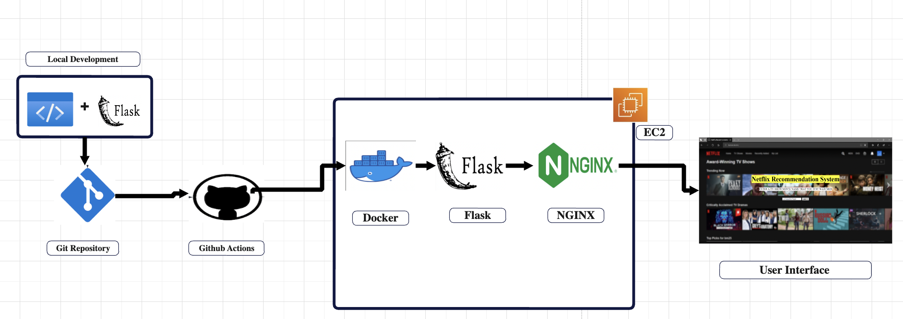

# Flask-Netflix-Recommendation-System
A flask web-app which can be used to get recommendations for a tv-show/movie, the app recommends a list of media according to the input.
# Architectural Diagram 

The Flask application is developed and tested on a local development environment.
Github actions are executed to build and test the application and deploy ro production environment
docker image is created for flask app and pushed to to ec2 that for developement (use : Docker is used to create a container image of the Flask application, which can be easily deployed on any system that supports Docker)

## userflow 
The Nginx is configured to use a reverse proxy to forward requests to the Flask container. (maps exposed port to an interal route)
The application is now accessible  through the Nginx container's exposed port on the host machine.

 
# Screenshot 1 : Main Page 
Here the user can enter their movie of choice, for example I have entered La Casa De Papel a Spanish Netflix original show.

# Screenshot 2 : Recommendation Page 
Here the user will get recommendations, for example I recieved Elite(another spanish Netflix original) as my top recommendation 

